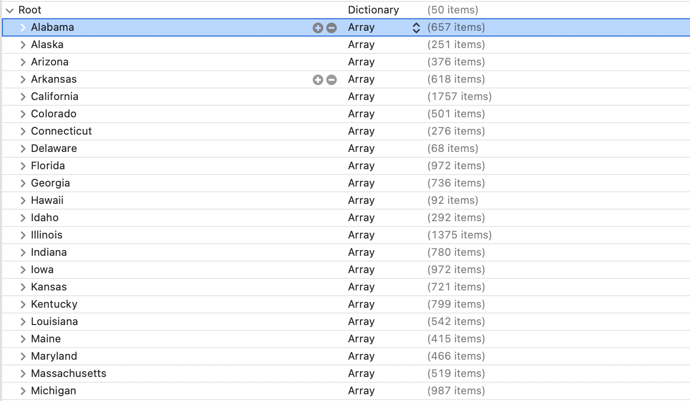
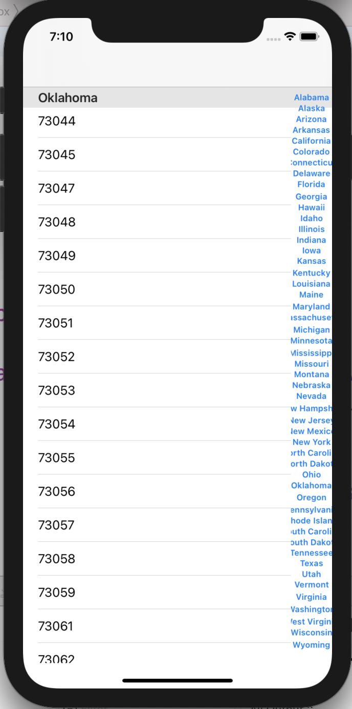

# 建立多Section的表格


## DataSource.swift

```swift
//
//  DataSource.swift
//  sandBox
//
//  Created by n135 on 2018/1/28.
//  Copyright © 2018年 n135. All rights reserved.
//

import Foundation
class DataSource{
    private init(){
        
    }
    static var states:[String:[String]] = {
        let paths = NSSearchPathForDirectoriesInDomains(.documentDirectory, .userDomainMask, true);
        let documentPath = paths.last!;
        let targetPath = "\(documentPath)/state.plist";
        print(targetPath);
        if !FileManager.default.fileExists(atPath: targetPath) {
            //只會執行一次
            let sourcePath = Bundle.main.path(forResource: "statedictionary", ofType: "plist");
            try! FileManager.default.moveItem(atPath: sourcePath!, toPath: targetPath);
        }
        if let states = NSDictionary(contentsOfFile: targetPath) as? [String:[String]]{
            return states
        }
        return [String:[String]]();
    }();
}


```

## ViewController

```swift
//
//  ViewController.swift
//  sandBox
//
//  Created by n135 on 2018/1/28.
//  Copyright © 2018年 n135. All rights reserved.
//

import UIKit

class ViewController: UIViewController {
    var states:[String:[String]] = DataSource.states;
    lazy var names = [String](states.keys).sorted();
    
    @IBOutlet var tableView:UITableView!;
    
    override func viewDidLoad() {
        super.viewDidLoad()
        tableView.dataSource = self;
        
       
    }

    override func didReceiveMemoryWarning() {
        super.didReceiveMemoryWarning()
        // Dispose of any resources that can be recreated.
    }


}

extension ViewController:UITableViewDataSource{
    func numberOfSections(in tableView: UITableView) -> Int{
        return names.count
    }
    
    func tableView(_ tableView: UITableView, numberOfRowsInSection section: Int) -> Int{
        let name = names[section];
        let postNums = states[name]!;
        return postNums.count;
    }
    
    func tableView(_ tableView: UITableView, cellForRowAt indexPath: IndexPath) -> UITableViewCell{
        let section = indexPath.section;
        let row = indexPath.row;
        let name = names[section];
        let postNums = states[name]!;
        let postNum = postNums[row];
        let cell = tableView.dequeueReusableCell(withIdentifier: "CELL", for: indexPath);
        cell.textLabel!.text = postNum;
        return cell;
    }
    
    func tableView(_ tableView: UITableView, titleForHeaderInSection section: Int) -> String?{
        return names[section];
    }
    
    func sectionIndexTitles(for tableView: UITableView) -> [String]?{
        return names;
    }
    
    
}


```



